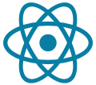
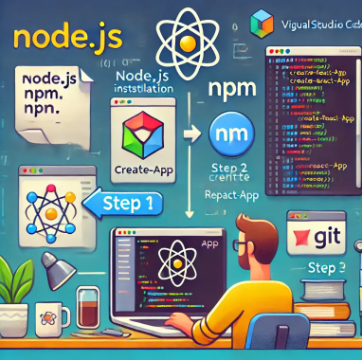

<a href="https://ko.react.dev/learn">

</a>

# D2505_React
> Facebook에서 개발한 오픈 소스 JavaScript 라이브러리로 <br/>
> 사용자 인터페이스(UI)를 구축하는 데 최적화되어 있으며, 특히 컴포넌트 기반 구조와 **가상 DOM(Virtual DOM)**을 활용하여 빠르고 효율적인 UI 업데이트가 가능 <br/>

---
### React 주요 특징
- `컴포넌트 기반` 개발 : UI를 작은 컴포넌트로 나누어 재사용성과 유지보수성을 높임
- `가상 DOM(Virtual DOM)` : 변경된 부분만 업데이트하여 성능 최적화
- `단방향 데이터 흐름` : 데이터가 한 방향으로만 흐르므로 예측 가능성이 높음
- `JSX(JavaScript XML)` : HTML과 유사한 문법을 사용하여 가독성을 높임
- 강력한 생태계 : `Redux`, `Next.js` 등 다양한 라이브러리와 프레임워크와 함께 사용 가능

★ React는 `싱글 페이지 애플리케이션(SPA) 개발`에 많이 사용되며, `모바일 앱 개발`을 위한 `React Native`도 함께 제공됩니다. 
<br/>

---
### React 개발 환경



#### 1. Node.js 설치
React 프로젝트를 실행하려면 Node.js가 필요합니다. [Node.js 공식 사이트](https://nodejs.org/)에서 LTS 버전을 다운로드하여 설치하세요.

#### 2. 패키지 관리자 설치
Node.js를 설치하면 기본적으로 npm이 포함되어 있습니다. yarn을 사용하려면 다음 명령어를 실행하세요:
```shell
npm install -g yarn
```

#### 3. React 프로젝트 생성
React 프로젝트를 빠르게 생성하려면 다음 명령어를 실행하세요:
```shell
npx create-react-app my-app
cd my-app
npm start
```
위 명령어를 실행하면 `localhost:3000` 에서 React 애플리케이션을 확인할 수 있습니다.

#### 4. VSCode 설치 및 확장 추가
Visual Studio Code를 설치하고 `ES7+ React/Redux/React-Native snippets` 등의 확장을 추가하면 개발이 편리해집니다.

#### 5. 컴포넌트 기반 개발
React는 컴포넌트 기반으로 동작하므로 `src` 폴더에서 `App.js`를 수정하며 개발을 진행할 수 있습니다.


cf. [개발환경 설치 및 프로젝트 셋팅 가이드](https://www.devitworld.com/coding/react/react-tutorial-env-setting-setup-guide/)


