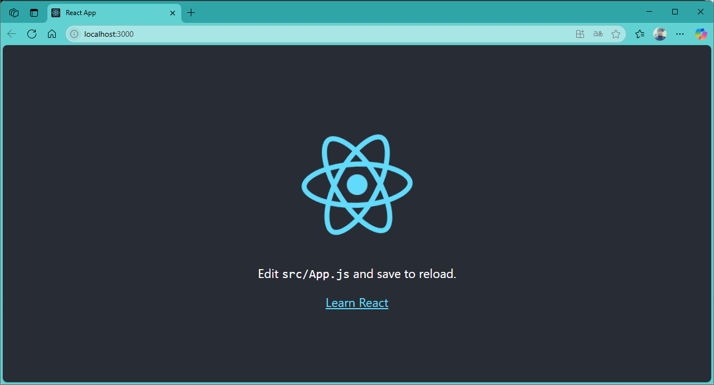

# React Practice

## 기본 명령어
| Command   | Description | 
|:----------|:------------|
| npx create-react-app `프로젝트명` | 새 React 프로젝트를 생성 |
| npm install   | `package.json`에 정의된 모든 패키지를 설치 |
| npm start     | 개발 모드에서 프로젝트를 실행, 기본적으로 `localhost:3000`에서 확인 |
| npm run build |  배포 가능한 상태로 정리된 파일을 `build` 폴더에 생성 |
| npm test      | 프로젝트 내 정의된 테스트를 실행 |
| npm uninstall `패키지명` | 설치된 패키지를 제거 |
| npm run `스크립트명`     | `package.json`에 정의된 스크립트를 실행할 때 사용 |
<br/>

---
### 프로젝트 실행 및 테스트

- voca 프로젝트 생성

```powershell
npx create-react-app vocs
```

- 개발 서버 실행 : npm start

```ps
PS C:\GitHub\D2505_React\lect> cd .\react\
PS C:\GitHub\D2505_React\lect\react> ls
PS C:\GitHub\D2505_React\lect\react> npx create-react-app voca

PS C:\GitHub\D2505_React\lect\react> cd voca
PS C:\GitHub\D2505_React\lect\react\voca> npm start

```

- 개벌 서버 화면 : index.js 를 호출
> localhost:3000
