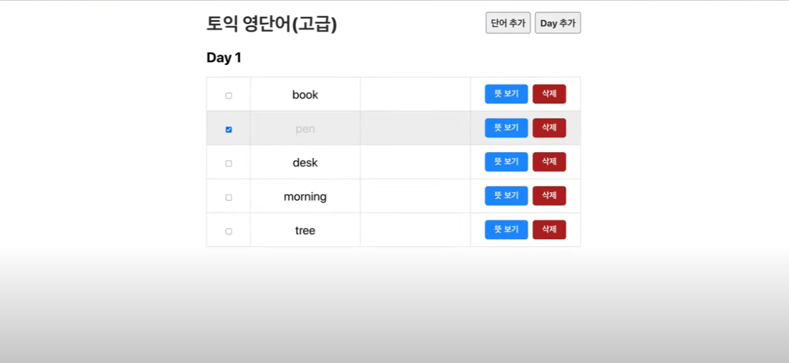

## S01. 소개

### 리액트 서비스 개발
- 컴포넌트 작성법, JSX, useState, useEffect, React Hook

- JSON서버를 띄우고, Rest API를 통신하면서 단어들을 추가/수정/삭제 

---
### 실습예제 : 영어단어 노트
- 단어노트 메인화면

- 일별 단어장

- `뜻 보기`,`뜻 숨기기` 토글 버튼

- 체크박스 상태유지 

- 단어 추가

- 추가단어 확인

---
### 리액트개발에 필요한 준비물
- Node.js

- VS Code

- JavaScript 이해해

- Source Code

