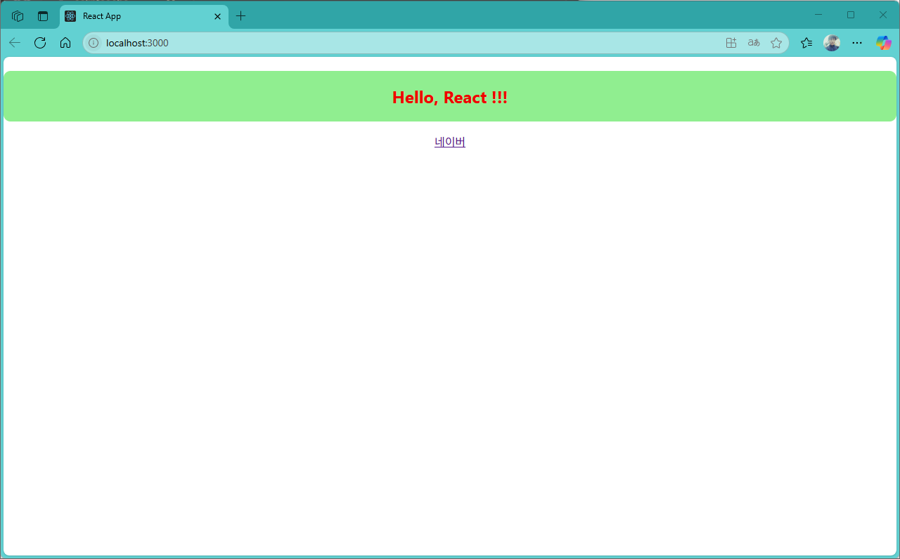
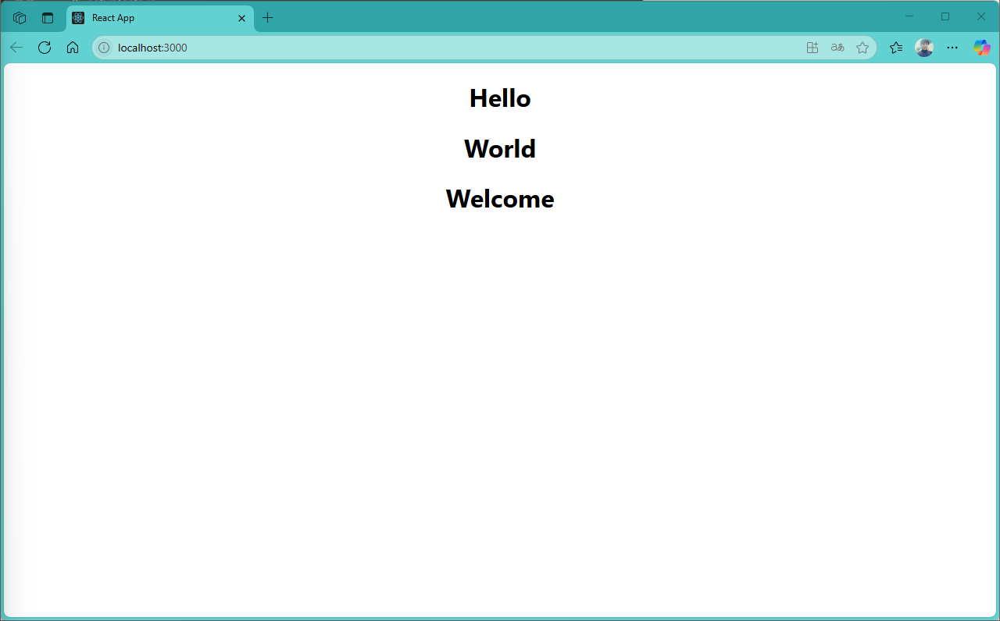
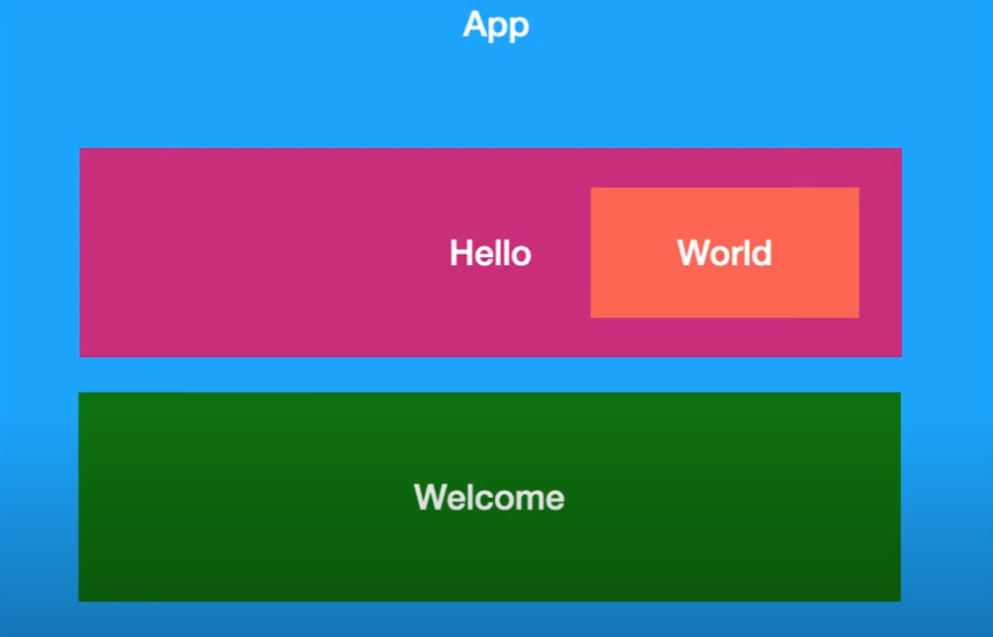
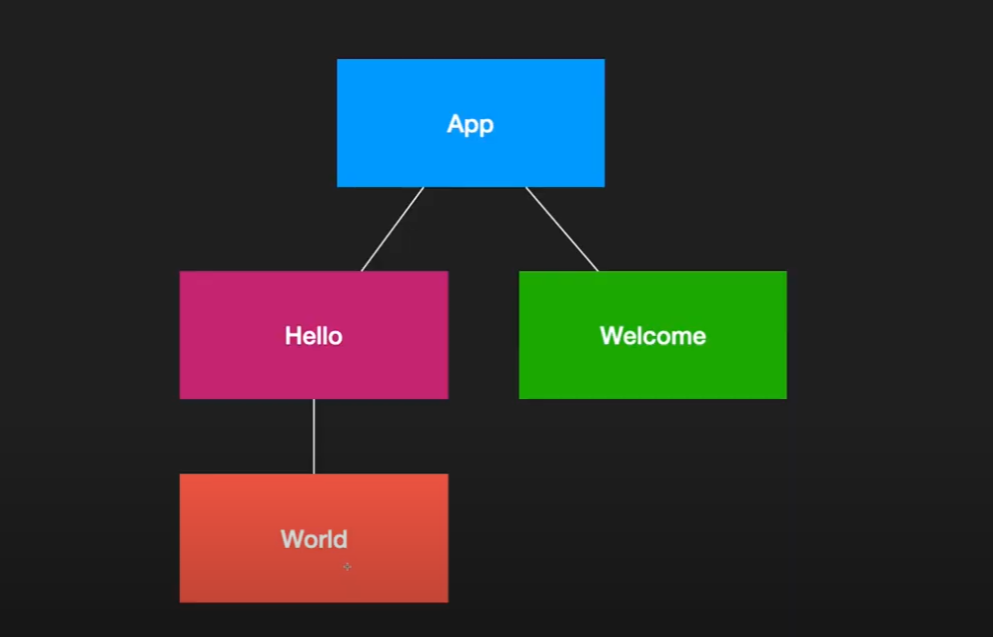

[](readme.md)

## S03. 컴포넌트, JSX(JavaScript XML)
> React에서 사용되는 문법으로, JavaScript 코드 안에서 HTML을 직관적으로 작성할 수 있도록 도와준다.

- [JSX 특징](#jsx-특징)
- [기본 화면](#기본-페이지---appjs)
- [콤포넌트 추가](#컴포넌트-추가)
- [스타일 적용](#스타일-적용)

---

### JSX 특징

- **HTML과 유사한 문법** : HTML 태그처럼 보이지만, JavaScript 내에서 작성
```jsx
const element = <h1>Hello, JSX!</h1>;
```
- **JavaScript 표현식 사용 가능** : {}를 사용하여 변수를 포함할 수 있다.
```jsx
const name = "Jace";
const element = <h1>Hello, {name}!</h1>;
```
- **컴파일 과정 필요** : JSX는 브라우저가 직접 이해할 수 없으므로 Babel 같은 트랜스파일러가 JavaScript 코드로 변환해야 한다.
- **React 컴포넌트에서 자주 사용** : JSX는 React 컴포넌트에서 UI를 정의하는 데 유용하다.
```jsx
function Greeting() {
    return <h1>Welcome to React!</h1>;
}
```

---
[[TOP]](#s03-컴포넌트-jsxjavascript-xml)
<br/>

### 기본 페이지 - App.js

- src/index.js
```js
import React from 'react';
import ReactDOM from 'react-dom/client';
import './index.css';
import App from './App';
import reportWebVitals from './reportWebVitals';

const root = ReactDOM.createRoot(document.getElementById('root'));
root.render(
  <React.StrictMode>
    <App />
  </React.StrictMode>
);
```

- src/App.js
```js
import "./App.css";

function App() {

  const name = "React";
  const naver = {
    name: "네이버",
    url: "https://www.naver.com"
  }

  return (
    <div className="App">
      <h1
        style={{
          color: "#EE0000",
          backgroundColor: "lightgreen",
          padding: "20px",
          borderRadius: "10px",
          fontSize: "24px",
          textAlign: "center",
          marginTop: "20px"
        }}>
        Hello, {name} !!!  
      </h1>
      <a href={naver.url}>
        {naver.name}
      </a>
    </div>
  );
}

export default App;
```

- localhost:3000



---
[[TOP]](#s03-컴포넌트-jsxjavascript-xml)
<br/>

### 컴포넌트 추가
- src/App.js
```js
import "./App.css";
import Hello from "./component/Hello";
import Welcome from "./component/Welcome";

function App() {

  return (
    <div className="App">
      <Hello/>
      <Welcome name="React" />
    </div>
  );
}

export default App;
```

- src/component/Hello.js
```js
import World from "./World";

export default function Hello() {
  return (
    <div>
      <h1>Hello</h1>
      <World />
    </div>
  );
}

```

- src/component/Welcome.js
```js
export default function Welcome() {
  return <h1>Welcome</h1>;
}

```

- src/component/World.js
```js
export default function World() {
  return <h1>World</h1>;
}

```

- localhost:3000


---
[[TOP]](#s03-컴포넌트-jsxjavascript-xml)
<br/>

- 컴포넌트 구조





### 스타일 적용

- component/Hello.js
```js
import World from "./World";

export default function Hello() {
  return (
    <div>
      <h1 style={{ 
        color: "#f00",
        fontSize: "24px",
        borderRight: "12px solid #000",
        marginBottom: "50px",
        opacity: 0.5, 
      }}
      >Hello</h1>
      <World />
    </div>
  );
}
```


- localhost:3000


