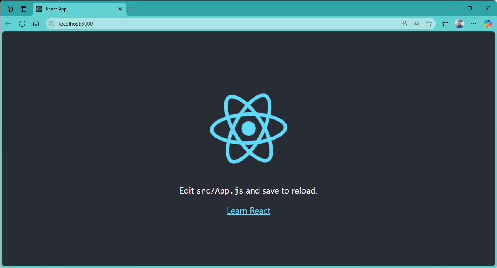

[](readme.md)

## S03. 컴포넌트, JSX

### JSX(JavaScript XML)
> React에서 사용되는 문법으로, JavaScript 코드 안에서 HTML을 직관적으로 작성할 수 있도록 도와준다.

### JSX 특징

- **HTML과 유사한 문법** : HTML 태그처럼 보이지만, JavaScript 내에서 작성
```jsx
const element = <h1>Hello, JSX!</h1>;
```
- **JavaScript 표현식 사용 가능** : {}를 사용하여 변수를 포함할 수 있다.
```jsx
const name = "Jace";
const element = <h1>Hello, {name}!</h1>;
```
- **컴파일 과정 필요** : JSX는 브라우저가 직접 이해할 수 없으므로 Babel 같은 트랜스파일러가 JavaScript 코드로 변환해야 한다.
- **React 컴포넌트에서 자주 사용** : JSX는 React 컴포넌트에서 UI를 정의하는 데 유용하다.
```jsx
function Greeting() {
    return <h1>Welcome to React!</h1>;
}
```


<br/>

## 프로젝트 앱 개발
- [프로젝트 생성 ](#프로젝트-생성)
- [개발 서버 실행](#개발-서버-실행)
- [개발 서버 중지](#개발-서버-중지)

---
[[기본 명령어]](#기본-명령어)
<br/>

### 프로젝트 생성 
- 프로젝트 생성 : npx create-react-app `프로젝트명`
```powershell
npx create-react-app vocs
```

- 개벌 서버 실행 : npm start
```powershell
PS C:\GitHub\D2505_React\lect> cd .\react\
PS C:\GitHub\D2505_React\lect\react> ls
PS C:\GitHub\D2505_React\lect\react> npx create-react-app voca

Creating a new React app in C:\GitHub\D2505_React\lect\react\voca.

Installing packages. This might take a couple of minutes.
Installing react, react-dom, and react-scripts with cra-template...


added 1324 packages in 50s

269 packages are looking for funding
  run `npm fund` for details

Installing template dependencies using npm...

added 18 packages, and changed 1 package in 4s

269 packages are looking for funding
  run `npm fund` for details
Removing template package using npm...


removed 1 package, and audited 1342 packages in 2s

269 packages are looking for funding
  run `npm fund` for details

8 vulnerabilities (2 moderate, 6 high)

To address all issues (including breaking changes), run:
  npm audit fix --force

Run `npm audit` for details.

Success! Created voca at C:\GitHub\D2505_React\lect\react\voca
Inside that directory, you can run several commands:

  npm start
    Starts the development server.

  npm run build
    Bundles the app into static files for production.

  npm test
    Starts the test runner.

  npm run eject
    Removes this tool and copies build dependencies, configuration files
    and scripts into the app directory. If you do this, you can’t go back!

We suggest that you begin by typing:

  cd voca
  npm start

Happy hacking!
npm notice
npm notice New major version of npm available! 10.9.2 -> 11.4.1
npm notice Changelog: https://github.com/npm/cli/releases/tag/v11.4.1
npm notice To update run: npm install -g npm@11.4.1
npm notice
PS C:\GitHub\D2505_React\lect\react>
PS C:\GitHub\D2505_React\lect\react> ls -force


    디렉터리: C:\GitHub\D2505_React\lect\react


Mode                 LastWriteTime         Length Name
----                 -------------         ------ ----
d-----      2025-06-03   오전 7:32                voca

```

[[기본 명령어]](#기본-명령어)
<br/>

### 개발 서버 실행

```powershell
PS C:\GitHub\D2505_React\lect\react> cd voca
PS C:\GitHub\D2505_React\lect\react\voca> ls


    디렉터리: C:\GitHub\D2505_React\lect\react\voca


Mode                 LastWriteTime         Length Name
----                 -------------         ------ ----
d-----      2025-06-03   오전 7:32                node_modules
d-----      2025-06-03   오전 7:32                public
d-----      2025-06-03   오전 7:32                src
-a----      2025-06-03   오전 7:32            310 .gitignore
-a----      2025-06-03   오전 7:32         663174 package-lock.json
-a----      2025-06-03   오전 7:32            845 package.json
-a----      2025-06-03   오전 7:32           3359 README.md


PS C:\GitHub\D2505_React\lect\react\voca> npm start

> voca@0.1.0 start
> react-scripts start

(node:5444) [DEP_WEBPACK_DEV_SERVER_ON_AFTER_SETUP_MIDDLEWARE] DeprecationWarning: 'onAfterSetupMiddleware' option is deprecated. Please use the 'setupMiddlewares' option.
(Use `node --trace-deprecation ...` to show where the warning was created)
(node:5444) [DEP_WEBPACK_DEV_SERVER_ON_BEFORE_SETUP_MIDDLEWARE] DeprecationWarning: 'onBeforeSetupMiddleware' option is deprecated. Please use the 'setupMiddlewares' option.
Starting the development server...
Compiled successfully!

You can now view voca in the browser.

  Local:            http://localhost:3000
  On Your Network:  http://192.168.54.82:3000

Note that the development build is not optimized.
To create a production build, use npm run build.

webpack compiled successfully

```

- localhost:3000


- `package.json` 만 있으면 `node_modules` 폴더는 굳이 `GitHub`에 올리지 않아도 됨
```json
{
  "name": "voca",
  "version": "0.1.0",
  "private": true,
  "dependencies": {
    "@testing-library/dom": "^10.4.0",
    "@testing-library/jest-dom": "^6.6.3",
    "@testing-library/react": "^16.3.0",
    "@testing-library/user-event": "^13.5.0",
    "react": "^19.1.0",
    "react-dom": "^19.1.0",
    "react-scripts": "5.0.1",
    "web-vitals": "^2.1.4"
  },
  "scripts": {
    "start": "react-scripts start",
    "build": "react-scripts build",
    "test": "react-scripts test",
    "eject": "react-scripts eject"
  },
  "eslintConfig": {
    "extends": [
      "react-app",
      "react-app/jest"
    ]
  },
  "browserslist": {
    "production": [
      ">0.2%",
      "not dead",
      "not op_mini all"
    ],
    "development": [
      "last 1 chrome version",
      "last 1 firefox version",
      "last 1 safari version"
    ]
  }
}

```

[[기본 명령어]](#기본-명령어)
<br/>

### 개발 서버 중지

> 커맨드창에서 `Ctrl + C` 키만 누르면 서버가 중지

