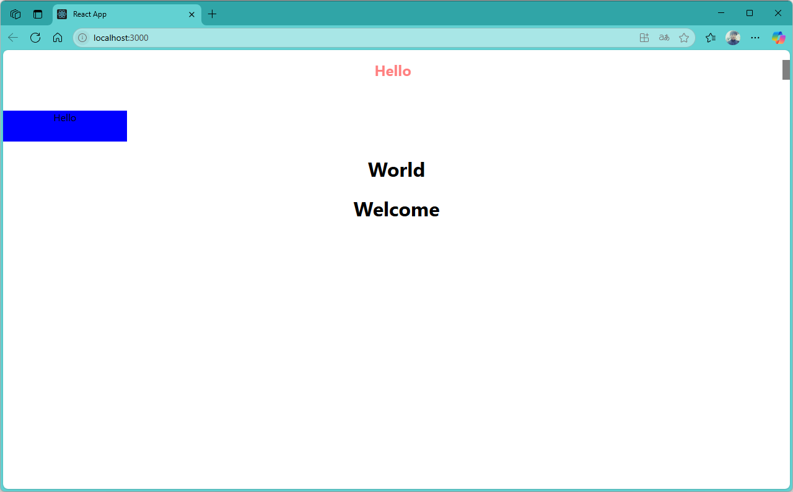

[](readme.md)

## S05. CSS 작성법(module css)
- [인라인 스타일](#인라인-스타일) : CSS 파일없이 태그안에 직접 style 작성
- [CSS파일 적용](#css파일-적용) : CSS 파일에 전체 or 앱페이지에 적용할 style 작성

---

### 인라인 스타일

- src/App.js
```js
import "./App.css";
import Hello from "./component/Hello";
import Welcome from "./component/Welcome";

function App() {

  return (
    <div className="App">
      <Hello/>
      <Welcome name="React" />
    </div>
  );
}

export default App;
```

- src/component/Hello.js
```js
import World from "./World";

export default function Hello() {
  return (
    <div>
      <h1 style={{ 
        color: "#f00",
        fontSize: "24px",
        borderRight: "12px solid #000",
        marginBottom: "50px",
        opacity: 0.5, 
      }}
      >Hello</h1>
      <World />
    </div>
  );
}

```

- src/component/Welcome.js
```js
export default function Welcome() {
  return <h1>Welcome</h1>;
}

```

- src/component/World.js
```js
export default function World() {
  return <h1>World</h1>;
}

```

- localhost:3000


---
[[TOP]](#s05-css-작성법module-css)
<br/>

### CSS파일 적용
> index.css : 전체 프로젝트에 미치는 스타일링 <br/>
> App.css : 앱 컴포넌트에 한정된 스타일링 

- src/index.css
```css
body {
  margin: 0;
  font-family: -apple-system, BlinkMacSystemFont, 'Segoe UI', 'Roboto', 'Oxygen',
    'Ubuntu', 'Cantarell', 'Fira Sans', 'Droid Sans', 'Helvetica Neue',
    sans-serif;
  -webkit-font-smoothing: antialiased;
  -moz-osx-font-smoothing: grayscale;
}

code {
  font-family: source-code-pro, Menlo, Monaco, Consolas, 'Courier New',
    monospace;
}

```
- src/App.css
```css
.App {
  text-align: center;
}

.App-logo {
  height: 40vmin;
  pointer-events: none;
}

@media (prefers-reduced-motion: no-preference) {
  .App-logo {
    animation: App-logo-spin infinite 20s linear;
  }
}

.App-header {
  background-color: #282c34;
  min-height: 100vh;
  display: flex;
  flex-direction: column;
  align-items: center;
  justify-content: center;
  font-size: calc(10px + 2vmin);
  color: white;
}

.App-link {
  color: #61dafb;
}

@keyframes App-logo-spin {
  from {
    transform: rotate(0deg);
  }
  to {
    transform: rotate(360deg);
  }
}

```


- component/Hello.js
```js
import World from "./World";

export default function Hello() {
  return (
    <div>
      <h1 style={{ 
        color: "#f00",
        fontSize: "24px",
        borderRight: "12px solid #000",
        marginBottom: "50px",
        opacity: 0.5, 
      }}
      >Hello</h1>
      <World />
    </div>
  );
}
```


---
[[TOP]](#s05-css-작성법module-css)
<br/>

### CSS파일에 클래스 추가

- src/App.css 에 class(.클래스명) 추가
```css
...............
...............

.box {
  width: 100px;
  height: 100px;
  background-color: red;
}

```

- src/component/Hello.css
```css
.box {
  width: 200px;
  height: 50px;
  background-color: blue;
}

```

- src/component/Hello.js
```js
import World from "./World";
import "./Hello.css";

export default function Hello() {
  return (
    <div>
      <h1 style={{ 
        color: "#f00",
        fontSize: "24px",
        borderRight: "12px solid #000",
        marginBottom: "50px",
        opacity: 0.5, 
      }}
      >
        Hello
      </h1>
      <div className="box">Hello</div>
      <World />

    </div>
  );
}

```


- localhost:3000


