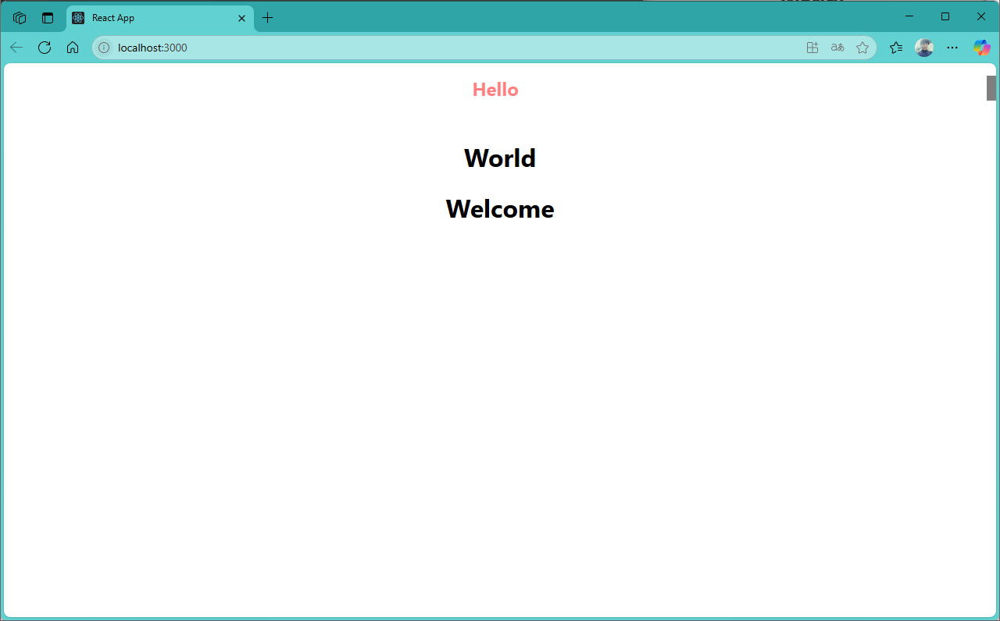
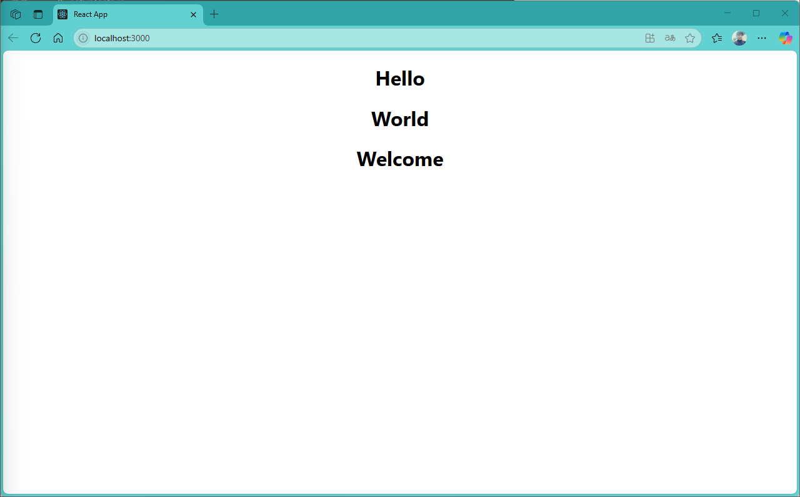

[](readme.md)

## S05. CSS 작성법(module css)
- [인라인 스타일](#인라인-스타일)


### 인라인 스타일

- src/App.js
```js
import "./App.css";
import Hello from "./component/Hello";
import Welcome from "./component/Welcome";

function App() {

  return (
    <div className="App">
      <Hello/>
      <Welcome name="React" />
    </div>
  );
}

export default App;
```

- src/component/Hello.js
```js
import World from "./World";

export default function Hello() {
  return (
    <div>
      <h1 style={{ 
        color: "#f00",
        fontSize: "24px",
        borderRight: "12px solid #000",
        marginBottom: "50px",
        opacity: 0.5, 
      }}
      >Hello</h1>
      <World />
    </div>
  );
}

```

- src/component/Welcome.js
```js
export default function Welcome() {
  return <h1>Welcome</h1>;
}

```

- src/component/World.js
```js
export default function World() {
  return <h1>World</h1>;
}

```

- localhost:3000



---
[[TOP]](#s05-css-작성법module-css)
<br/>


### 스타일 적용

- component/Hello.js
```js
import World from "./World";

export default function Hello() {
  return (
    <div>
      <h1 style={{ 
        color: "#f00",
        fontSize: "24px",
        borderRight: "12px solid #000",
        marginBottom: "50px",
        opacity: 0.5, 
      }}
      >Hello</h1>
      <World />
    </div>
  );
}
```


- localhost:3000


