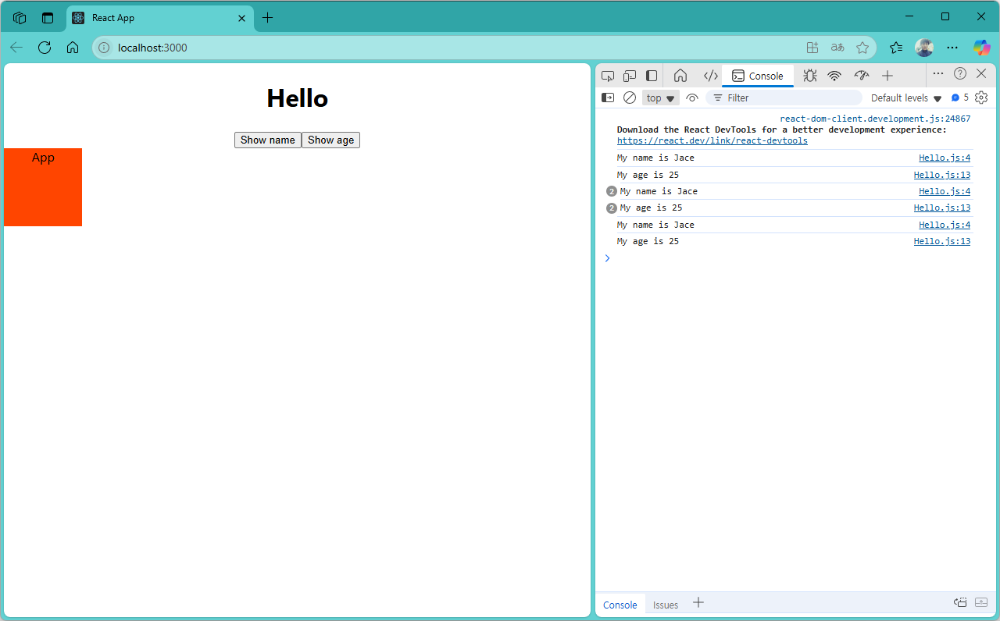
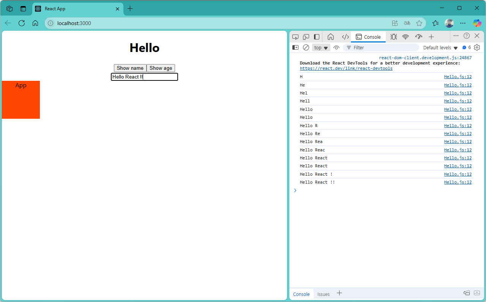
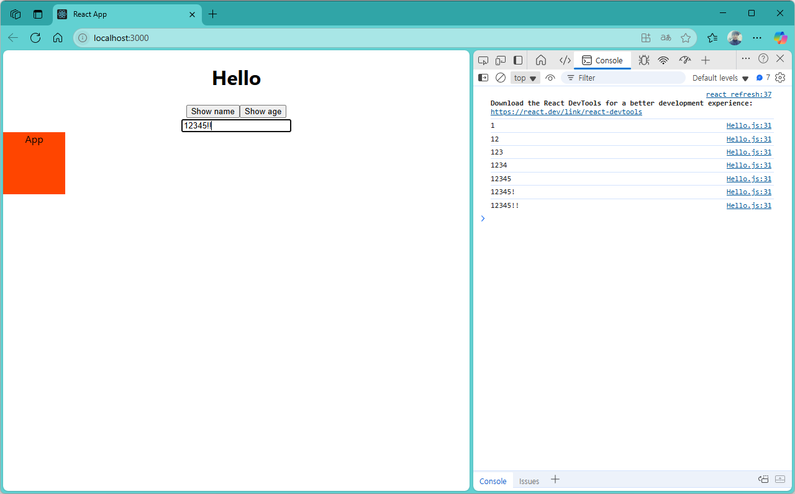

[](readme.md)

## S06. 이벤트 처리(Handling Events)
- [버턴 클릭 이벤트](#버턴-클릭-이벤트) : `Show name`, `Show age` 버튼클릭시 콘솔 로그에 출력
- [입력 이벤트1](#입력-이벤트1) : Input 입력창에 text 입력시 콘솔 로그에 출력
- [입력 이벤트2](#입력-이벤트2) : Input 입력창에 text 입력시 콘솔 로그에 출력

---

### 버턴 클릭 이벤트

- src/App.js
```js
import "./App.css";
import Hello from "./component/Hello";
import Welcome from "./component/Welcome";
import styles from "./App.module.css";

function App() {

  return (
    <div className="App">
      <Hello/>
      <div className={styles.box}>App</div>
    </div>
  );
}

export default App;
```

- src/component/Hello.js
```js
export default function Hello() {

  function showName() {
    console.log("My name is Jace");
  }

  return (
    <div>
      <h1>Hello</h1>
      <button onClick={showName}>Show name</button>
      <button
        onClick={() => {
          console.log("My age is 25");
        }} 
      >
        Show age
      </button>
    </div>
  );
}

```


- localhost:3000



---
[[TOP]](#s06-이벤트-처리handling-events)
<br/>

### 입력 이벤트1


- src/component/Hello.js
```js
export default function Hello() {

  function showName() {
    console.log("My name is Jace");
  }

  function showAge() {
    console.log("My age is 25");
  } 

  function showText(e) {
    console.log(e.target.value);
  }

  return (
    <div>
      <h1>Hello</h1>
      <button onClick={showName}>Show name</button>
      <button
        onClick={() => {
          console.log("My age is 25");
        }} 
      >
        Show age
      </button>
      <br/>
      <input type="text" onChange={showText} />
    </div>
  );
}

```

- localhost:3000



---
[[TOP]](#s06-이벤트-처리handling-events)
<br/>

### 입력 이벤트2

- src/component/Hello.js
```js
export default function Hello() {

  function showName() {
    console.log("My name is Jace");
  }

  function showAge() {
    console.log("My age is 25");
  } 

  function showText(txt) {
    console.log(txt);
  }

  return (
    <div>
      <h1>Hello</h1>
      <button onClick={showName}>Show name</button>
      <button
        onClick={() => {
          console.log("My age is 25");
        }} 
      >
        Show age
      </button>
      <br/>
      <input 
        type="text" 
        onChange={e => {
          const txt = e.target.value;
          console.log(txt); 
        }}
      />
    </div>
  );
}

```

- localhost:3000



---
[[TOP]](#s06-이벤트-처리handling-events)
<br/>

