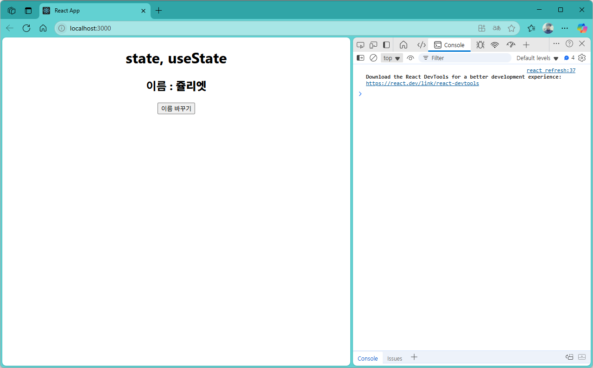
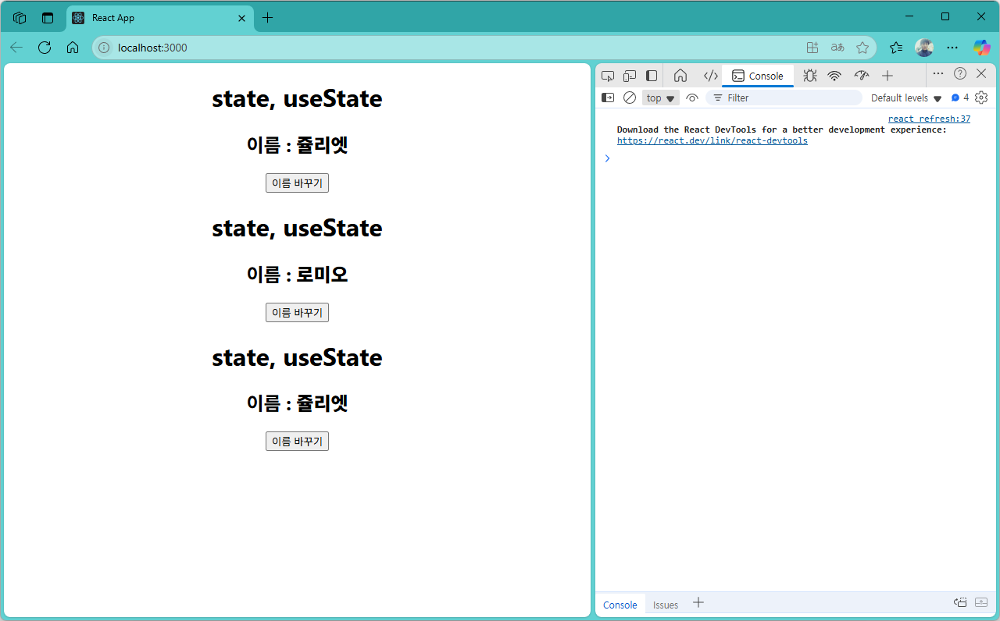

[](readme.md)

## S07. state, useState
- [상태값 변경1](#상태값-변경1) : 버튼 클릭시 컴포넌트 속성값 변경 콘솔에 출력
- [상태값 변경2](#상태값-변경2) : 버튼 클릭시 DOM을 조작하여 변경된 값을 반영
- [상태값 변경3](#상태값-변경3) : 버튼 클릭시 useState를 활용하여 상태값을 직접 변경 
- [상태값 변경4](#상태값-변경4) : 최종적으로 function을 onClick 이벤트에 직접 구현하여 변경

---

**[Tip] React에서 논리연산자** 
1. 같다 (Equality)
- == : 느슨한 비교 (값만 비교, 타입 변환 가능)
- === : 엄격한 비교 (값과 타입 모두 비교)
```jsx
const a = "5";
const b = 5;

console.log(a == b);  // true (타입 변환 후 비교)
console.log(a === b); // false (타입이 다름)
```
2. 같지 않다 (Inequality)
- != : 느슨한 비교 (값만 비교, 타입 변환 가능)
- !== : 엄격한 비교 (값과 타입 모두 비교)
```jsx
const x = "10";
const y = 10;

console.log(x != y);  // false (타입 변환 후 비교)
console.log(x !== y); // true (타입이 다름)
```
3. 활용예시
- React에서 조건부 렌더링을 할 때 논리 연산자를 사용할 수 있다.
```jsx
function Example({ value }) {
  return (
    <div>
      {value === 10 ? <p>값이 10입니다.</p> : <p>값이 10이 아닙니다.</p>}
    </div>
  );
}
```
- 또는 `&&` 연산자를 활용하여 특정 조건이 참일 때만 렌더링할 수도 있습니다.
```jsx
function Example({ value }) {
  return (
    <div>
      {value !== 10 && <p>값이 10이 아닙니다.</p>}
    </div>
  );
}
```
※ 참조 : [React 공식 문서](https://ko.react.dev/learn/conditional-rendering)

---

### 상태값 변경1

- src/App.js
```js
import "./App.css";
import Hello from "./component/Hello";
import Welcome from "./component/Welcome";
import styles from "./App.module.css";

function App() {

  return (
    <div className="App">
      <Hello/>
    </div>
  );
}

export default App;

```

- src/component/Hello.js
```js
export default function Hello() {
  let name = "로미오";

  function changeName() {
    name = name === "로미오" ? "쥴리엣" : "로미오";
    console.log(name);  // 상태가 변경되었지만, React는 이 변경을 감지하지 못합니다.
  }

  return (
    <div>
      <h1>state</h1>
      <h2>컴포넌트의 속성값</h2>
      <h2>이름 : {name}</h2>
      <button onClick={changeName}>이름 바꾸기</button>
    </div>
  );
}

```

- localhost:3000


---
[[TOP]](#s07-state-usestate)
<br/>

### 상태값 변경2

- src/component/Hello.js
```js
export default function Hello() {
  let name = "로미오";

  function changeName() {
    name = name === "로미오" ? "쥴리엣" : "로미오";
    console.log(name);  // 상태가 변경되었지만, React는 이 변경을 감지하지 못합니다.
    document.getElementById("name").innerText = name; // 직접 DOM을 조작하여 변경된 값을 반영합니다.
    // React에서는 상태 변경을 감지하지 못하기 때문에, 직접 DOM을 조작하는 것은 권장되지 않습니다.
    // React에서는 상태를 변경할 때, setState 또는 useState 훅을 사용해야 합니다.
  }

  return (
    <div>
      <h1>state</h1>
      <h2>컴포넌트의 속성값</h2>
      <h2>이름 : <b id="name">{name}</b></h2>
      <button onClick={changeName}>이름 바꾸기</button>
    </div>
  );
}

```

- localhost:3000


---
[[TOP]](#s07-state-usestate)
<br/>

### 상태값 변경3

- src/component/Hello.js
```js
import { useState } from "react";
// 컴포넌트의 상태를 관리하기 위해 useState 훅을 사용합니다.
// useState 훅은 컴포넌트의 상태를 선언하고, 상태가 변경될 때 컴포넌트를 다시 렌더링합니다.
// useState 훅을 사용하지 않고, 직접 변수로 상태를 관리하는 것은 React의 상태 관리 방식을 따르지 않기 때문에, 
// React의 장점을 활용하지 못합니다.

export default function Hello() {
  // let name = "로미오";
  const [name, setName] = useState("로미오");

  function changeName() {
    const newName = name === "로미오" ? "쥴리엣" : "로미오";
    // document.getElementById("name").innerText = name; 
    setName(newName); // useState 훅을 사용하여 상태를 변경합니다.
  }

  return (
    <div>
      <h1>state, useState</h1>
      <h2>이름 : <b id="name">{name}</b></h2>
      <button onClick={changeName}>이름 바꾸기</button>
    </div>
  );
}

```

- localhost:3000


---
[[TOP]](#s07-state-usestate)
<br/>

### 상태값 변경4

- src/component/Hello.js
```js
import { useState } from "react";
// 컴포넌트의 상태를 관리하기 위해 useState 훅을 사용합니다.
// useState 훅은 컴포넌트의 상태를 선언하고, 상태가 변경될 때 컴포넌트를 다시 렌더링합니다.
// useState 훅을 사용하지 않고, 직접 변수로 상태를 관리하는 것은 React의 상태 관리 방식을 따르지 않기 때문에, 
// React의 장점을 활용하지 못합니다.

export default function Hello() {
  // let name = "로미오";
  const [name, setName] = useState("로미오");

  // function changeName() {
  //   name = name === "로미오" ? "쥴리엣" : "로미오";
  //   // document.getElementById("name").innerText = name; 
  //   setName(name); // useState 훅을 사용하여 상태를 변경합니다.
  // }

  return (
    <div>
      <h1>state, useState</h1>
      <h2>이름 : <b id="name">{name}</b></h2>
      <button 
        onClick={() => {
          setName(name === "로미오" ? "쥴리엣" : "로미오");
        }}
      >
        이름 바꾸기
      </button>
    </div>
  );
}

```

- src/App.js
```js
import "./App.css";
import Hello from "./component/Hello";
import Welcome from "./component/Welcome";
import styles from "./App.module.css";

function App() {

  return (
    <div className="App">
      <Hello/>
      <Hello/>
      <Hello/>
    </div>
  );
}

export default App;

```

- localhost:3000


---
[[TOP]](#s07-state-usestate)
<br/>

