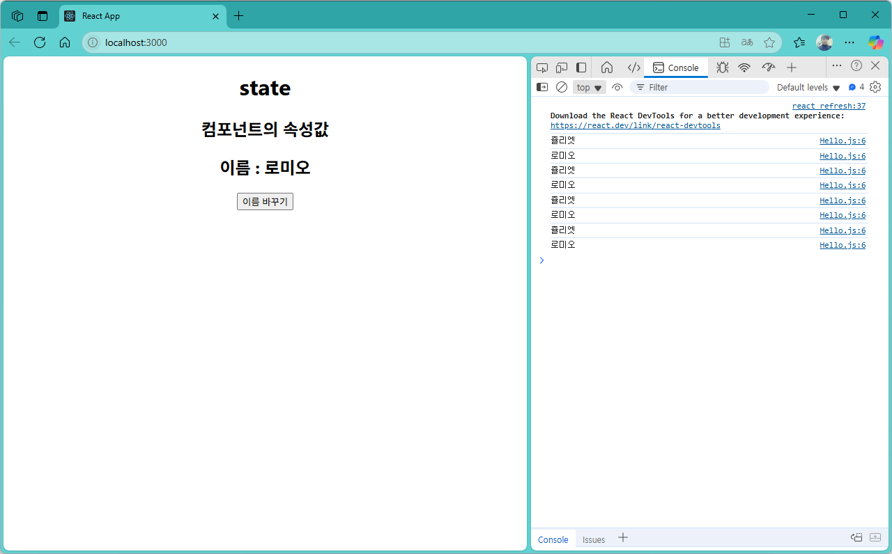
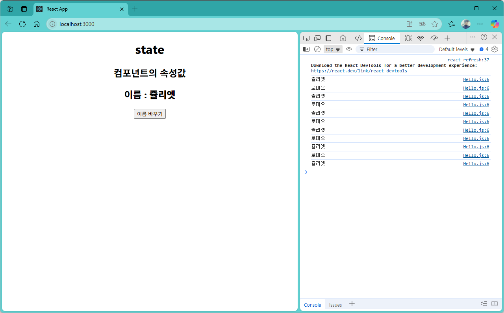

[](readme.md)

## S07. state, useState
- [상태값 변경1](#상태값-변경1) : 버튼 클릭시 컴포넌트 속성값 변경 콘솔에 출력
- [상태값 변경2](#상태값-변경2) : 버튼 클릭시 DOM을 조작하여 변경된 값을 반영

---

### 상태값 변경1

- src/App.js
```js
import "./App.css";
import Hello from "./component/Hello";
import Welcome from "./component/Welcome";
import styles from "./App.module.css";

function App() {

  return (
    <div className="App">
      <Hello/>
    </div>
  );
}

export default App;

```

- src/component/Hello.js
```js
export default function Hello() {
  let name = "로미오";

  function changeName() {
    name = name === "로미오" ? "쥴리엣" : "로미오";
    console.log(name);  // 상태가 변경되었지만, React는 이 변경을 감지하지 못합니다.
  }

  return (
    <div>
      <h1>state</h1>
      <h2>컴포넌트의 속성값</h2>
      <h2>이름 : {name}</h2>
      <button onClick={changeName}>이름 바꾸기</button>
    </div>
  );
}

```

- localhost:3000


---
[[TOP]](#s07-state-usestate)
<br/>

### 상태값 변경2

- src/component/Hello.js
```js
export default function Hello() {
  let name = "로미오";

  function changeName() {
    name = name === "로미오" ? "쥴리엣" : "로미오";
    console.log(name);  // 상태가 변경되었지만, React는 이 변경을 감지하지 못합니다.
    document.getElementById("name").innerText = name; // 직접 DOM을 조작하여 변경된 값을 반영합니다.
    // React에서는 상태 변경을 감지하지 못하기 때문에, 직접 DOM을 조작하는 것은 권장되지 않습니다.
    // React에서는 상태를 변경할 때, setState 또는 useState 훅을 사용해야 합니다.
  }

  return (
    <div>
      <h1>state</h1>
      <h2>컴포넌트의 속성값</h2>
      <h2>이름 : <b id="name">{name}</b></h2>
      <button onClick={changeName}>이름 바꾸기</button>
    </div>
  );
}

```

- localhost:3000


---
[[TOP]](#s07-state-usestate)
<br/>

### 상태값 변경3
