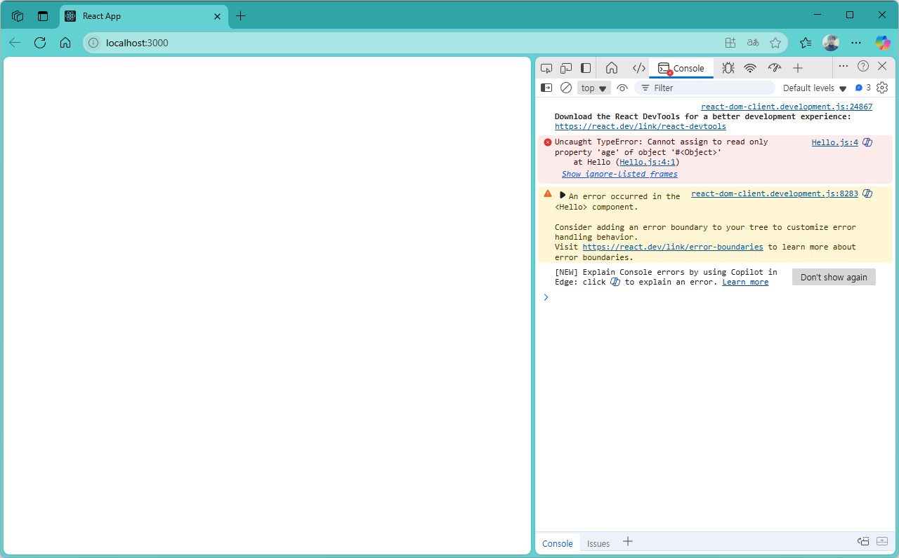

[](readme.md)

## S08. props	
> React에서 Props(Properties)는 컴포넌트 간 데이터를 전달하는 방식 <br/>
> ▶ **읽기 전용(Read-Only)** : Props는 변경할 수 없는 값입니다. 컴포넌트 내부에서 직접 수정할 수 없습니다. <br/>
> ▶ **부모 → 자식 데이터 전달** : 부모 컴포넌트가 값을 정의하고, 자식 컴포넌트는 이를 받아서 사용합니다. <br/>

### 속성값으로 컴포넌트 간 데이터 전달 : *props.속성*
- [속성값 전달1](#속성값-전달1) : 컴포넌트의 속성값 읽어오기. 
- [속성값 전달2](#속성값-전달2) : 읽어온 속성값을 state로 관리
- [속성값 전달3](#속성값-전달3) : 읽어온 속성값을 state로 관리
- [속성값 전달4](#속성값-전달4) : 컴포넌트의 속성값 변경하기.

---

**[Tip] React에서 { }(중괄호)** 
1. 변수 출력
- JSX 내부에서 변수를 사용할 때 {}를 사용한다.
```jsx
const name = "Jace";
return <h1>{name}님, 환영합니다!</h1>;
```
 → 화면에 "Jace님, 환영합니다!" 출력

2. 연산 및 함수 호출
- {} 내부에서 연산을 수행하거나 함수를 호출할 수 있다.
```jsx
const age = 25;
return <p>내년에는 {age + 1}살이 됩니다.</p>;
```

3. → `isLoggedIn` 이 `true`면 "로그인 성공!", `false`면 "로그인 필요" 출력

4. 배열 및 객체 사용
- {}를 사용하여 배열을 매핑하거나 객체 속성을 출력할 수 있다.
```jsx
const users = ["Alice", "Bob", "Charlie"];
return (
  <ul>
    {users.map((user) => (
      <li key={user}>{user}</li>
    ))}
  </ul>
);
```
→ 리스트 형태로 Alice, Bob, Charlie 출력

5. 인라인 스타일 적용
- React에서는 `스타일`을 객체 형태로 작성해야 하므로 `{}를 두 번 사용`한다.
```jsx
const style = { color: "blue", fontSize: "20px" };
return <p style={style}>파란색 텍스트</p>;
```
→ 파란색 텍스트 출력


※ 참조 : [React { }의 사용](https://velog.io/@chaerin00/React-%EC%9D%98-%EC%9D%98%EB%AF%B8)

---

### 속성값 전달1 
> Error 발생 !!!

- src/App.js
```js
import "./App.css";
import Hello from "./component/Hello";

function App() {

  return (
    <div className="App">
      <h3>props : properties</h3>
      <Hello age={10}/>
      <Hello age={20}/>
      <Hello age={30}/>
    </div>
  );
}

export default App;

```

- src/component/Hello.js
```js
import { useState } from "react";

export default function Hello(props) {
  // props.age = 100; // props는 변경할 수 없습니다. 이 코드는 무시됩니다.
  
  const [name, setName] = useState("로미오");
  const [age, setAge] = useState(props.age);
  // props.age는 변경할 수 없으므로, state로 age를 관리합니다.
  // props는 컴포넌트가 렌더링될 때 전달되는 값으로, 변경할 수 없습니다.  
  
  return (
    <div>
      <h1>props (=properties)</h1>
      <h2>이름 : 
        <b id="name">
          {name}({props.age})
        </b>
      </h2>
      <button 
        onClick={() => {
          setName(name === "로미오" ? "쥴리엣" : "로미오");
          setAge(age + 1); // age를 1씩 증가시킵니다.
          // setAge(props.age + 1); // props.age는 변경할 수 없으므로, 이렇게 하면 안 됩니다.

        }}
      >
        이름 바꾸기
      </button>
    </div>
  );
}


```

- localhost:3000


```console
Hello.js:4  Uncaught TypeError: Cannot assign to read only property 'age' of object '#<Object>'
    at Hello (Hello.js:4:1)
```

- localhost:3000
> setAge(age + 1); 를 주석처리


---
[[TOP]](#s08-props)
<br/>

### 속성값 전달2

- src/component/Hello.js
```js
import { useState } from "react";

export default function Hello({age}) {
  const [name, setName] = useState("로미오");
  // const [age, setAge] = useState(props.age);
  // props.age는 변경할 수 없으므로, state로 age를 관리합니다.
  // props는 컴포넌트가 렌더링될 때 전달되는 값으로, 변경할 수 없습니다.  

  const msg = age > 19 ? "성인입니다." : "청소년입니다.";

  
  return (
    <div>
      <h1>props (=properties) </h1>
      <h2>속성값 : 
        <b id="name">
          {name}({age}) : {msg} 
        </b>
      </h2>
      <button 
        onClick={() => {
          setName(name === "로미오" ? "쥴리엣" : "로미오");
          // setAge(age + 1); // age를 1씩 증가시킵니다.
          // setAge(props.age + 1); // props.age는 변경할 수 없으므로, 이렇게 하면 안 됩니다.

        }}
      >
        이름 바꾸기
      </button>
    </div>
  );
}

```

- localhost:3000


---
[[TOP]](#s08-props)
<br/>

### 속성값 전달3

- src/component/UserName.js
```js
export default function UserName({name}) {
    return <p>Hello, {name}</p>
}
// 위의 Hello 컴포넌트와 동일한 기능을 하는 UserName 컴포넌트입니다.
// UserName 컴포넌트는 name이라는 prop을 받아서 "Hello, {name}"을 출력합니다.
```

- src/component/Hello.js
```js
import { useState } from "react";
import UserName from "./UserName";

export default function Hello({age}) {
  const [name, setName] = useState("로미오");
  const msg = age > 19 ? "성인입니다." : "청소년입니다.";
  
  return (
    <div>
      <h1>props (=properties) </h1>
      <h2>속성값 : 
        <b id="name">
          {name}({age}) : {msg} 
        </b>
      </h2>
      <UserName name={name} />
      <button 
        onClick={() => {
          setName(name === "로미오" ? "쥴리엣" : "로미오");
        }}
      >
        이름 바꾸기
      </button>
    </div>
  );
}

```

- localhost:3000


---
[[TOP]](#s08-props)
<br/>

### 속성값 전달4

- src/App.js
```jsx
import "./App.css";
import Hello from "./component/Hello";

function App() {

  return (
    <div className="App">
      <h3>props : properties</h3>
      <Hello init_age={18}/>
    </div>
  );
}

export default App;
```


- src/component/Hello.js
```jsx
import { useState } from "react";
import UserName from "./UserName";

export default function Hello({init_age = 10, ...props}) {
  const [name, setName] = useState(props.name);
  const [age, setAge] = useState(props.age === undefined ? init_age : props.age);
  // const msg = age > 19 ? "성인입니다." : "청소년입니다.";
  
  return (
    <div>
      <h1>props (=properties) </h1>
      <center>
      <table border="1" cellPadding="5" cellSpacing="0">
        <tr>
          <td width={100}>이름</td>
          <td width={100}>나이</td>
          <td width={300}>메시지</td>
        </tr>
        <tr>
          <td><b id="name">{name === undefined ? "쥴리엣" : name}</b></td>
          <td><b id="age">{age === undefined ? init_age : age}</b></td>
          <td><b id="msg">{age > 19 ? "성인입니다." : "청소년입니다."}</b></td>
        </tr>
      </table>
      </center>

      <UserName name={name} />

      <button 
        onClick={() => {
          setName(name === "로미오" ? "쥴리엣" : "로미오");
        }}
      >
        이름 바꾸기
      </button> &nbsp;
      <button 
        onClick={() => {
          setAge(age === undefined ? init_age : age + 1);
          // setAge(props.age + 1); // props.age는 변경할 수 없으므로, 이렇게 하면 안 됩니다.
        }}
      >
        나이 +1
      </button> &nbsp;
      <button 
        onClick={() => {
          setAge(age === undefined ? init_age : age - 1);
        }}
      >
        나이 -1
      </button>
    </div>
  );
}


```


- localhost:3000


---
[[TOP]](#s08-props)
<br/>
