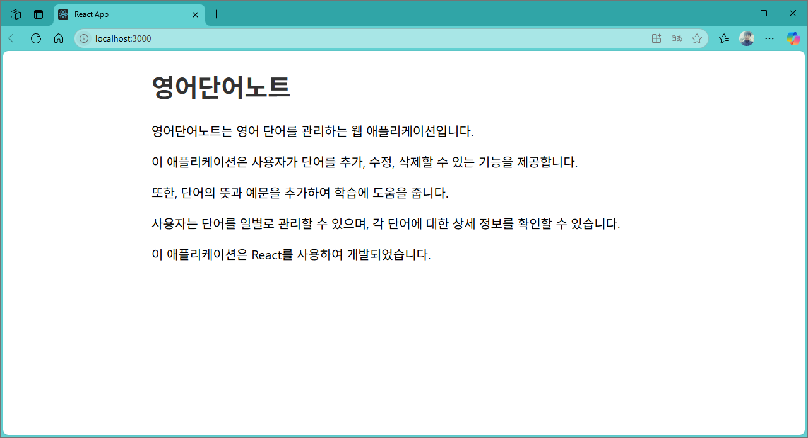

[](readme.md)

## S09. 프로젝트 착수	
> React 에서 서비스 개발시 초기화 작업

### 단어장 개발 
- [프로젝트 생성](#프로젝트-생성) : 새 프로젝트(word) 생성 
- [기본 스타일](#기본-스타일) : 전체에 기본적으로 적용할 스타일(index.css)을 Copy & Paste
- [기본 데이터](#기본-데이터) : 기본적으로 관리할 데이터 파일(db/data.json) 생성
- [기본 페이지](#기본-페이지) : 웹서버 구동시 뜨는 첫화면 Default 로 초기화 (index.js, App.js)
- [웹서버 구동](#웹서버-구동) : React 서버 구동 후 브라우저에서 화면 체크

---

### 프로젝트 생성

- npx 명령어로 프로젝트 생성
```powershell
npx create-react-app voca
```
<br/>

---

### 기본 스타일 
- 기본스타일 C&P, src/index.css
```css
body {
  margin: 0;
  font-family: -apple-system, BlinkMacSystemFont, "Segoe UI", "Roboto", "Oxygen",
    "Ubuntu", "Cantarell", "Fira Sans", "Droid Sans", "Helvetica Neue",
    sans-serif;
  -webkit-font-smoothing: antialiased;
  -moz-osx-font-smoothing: grayscale;
  font-size: 20px;
}

ol,
ul {
  margin: 0;
  padding: 0;
  list-style: none;
}

code {
  font-family: source-code-pro, Menlo, Monaco, Consolas, "Courier New",
    monospace;
}

a {
  text-decoration: none;
  color: #333;
}

.App {
  width: 800px;
  margin: 0 auto;
}

.header {
  position: relative;
}

.header .menu {
  position: absolute;
  top: 10px;
  right: 0;
}

.header .link {
  border: 1px solid #333;
  padding: 10px;
  margin-left: 10px;
  background-color: #efefef;
  font-weight: bold;
  border-radius: 4px;
}

.list_day {
  display: flex;
  flex-wrap: wrap;
}

.list_day li {
  flex: 20% 0 0;
  box-sizing: border-box;
  padding: 10px;
}

.list_day a {
  display: block;
  padding: 20px 0;
  font-weight: bold;
  color: #fff;
  text-align: center;
  border-radius: 10px;
  background-color: dodgerblue;
}

table {
  border-collapse: collapse;
  width: 100%;
}
table td {
  width: 25%;
  height: 70px;
  border: 1px solid #ccc;
  text-align: center;
  font-size: 26px;
}

table td:first-child {
  width: 10%;
}

.off td {
  background: #eee;
  color: #ccc;
}

.btn_del {
  margin-left: 10px;
  color: #fff;
  background-color: firebrick;
}

button {
  padding: 10px;
  font-weight: bold;
  font-size: 18px;
  cursor: pointer;
  border: 0 none;
  border-radius: 6px;
  padding: 10px 20px;
  color: #fff;
  background-color: dodgerblue;
}

.input_area {
  margin-bottom: 10px;
}

.input_area label {
  display: block;
  margin-bottom: 10px;
}

.input_area input {
  width: 400px;
  height: 40px;
  font-size: 20px;
  padding: 0 10px;
}

.input_area select {
  width: 400px;
  height: 40px;
  font-size: 20px;
}

```
<br/>

---
[[TOP]](#s09-프로젝트-착수)
<br/>

### 기본 데이터

- db/data.json : 데이터 파일 생성
```json
{
  "days": [
    { "id": 1, "day": 1 },
    { "id": 2, "day": 2 },
    { "id": 3, "day": 3 }, 
    { "id": 4, "day": 4 }
  ],
  "words": [
    {
      "id": 1,
      "day": 1,
      "eng": "book",
      "kor": "책",
      "isDone": false
    },
    {
      "id": 3,
      "day": 2,
      "eng": "car",
      "kor": "자동차",
      "isDone": false
    },
    {
      "id": 5,
      "day": 3,
      "eng": "school",
      "kor": "학교",
      "isDone": false
    },
    {
      "id": 6,
      "day": 3,
      "eng": "pencil",
      "kor": "연필",
      "isDone": false
    }
  ]
}

```
<br/>

---
[[TOP]](#s09-프로젝트-착수)
<br/>

### 기본 페이지

- index.js 
```js
import React from 'react';
import ReactDOM from 'react-dom/client';
import './index.css';
import App from './App';
import reportWebVitals from './reportWebVitals';

const root = ReactDOM.createRoot(document.getElementById('root'));
root.render(
  <React.StrictMode>
    <App />
  </React.StrictMode>
);

reportWebVitals();

```

- App.js
```js
function App() {
  return (
    <div className="App">
      <header className="App-header">
        <h1>
          <a href="/">영어단어노트</a>
        </h1>
        {/* <DayList /> */}
        <p>영어단어노트는 영어 단어를 관리하는 웹 애플리케이션입니다.</p>
        <p>이 애플리케이션은 사용자가 단어를 추가, 수정, 삭제할 수 있는 기능을 제공합니다.</p>
        <p>또한, 단어의 뜻과 예문을 추가하여 학습에 도움을 줍니다.</p>
        <p>사용자는 단어를 일별로 관리할 수 있으며, 각 단어에 대한 상세 정보를 확인할 수 있습니다.</p>
        <p>이 애플리케이션은 React를 사용하여 개발되었습니다.</p>
      </header>
    </div>
  );
}

export default App;


```


### 웹서버 구동
```powershell
npm start
```

- localhost:3000


---
[[TOP]](#s09-프로젝트-착수)
<br/>

