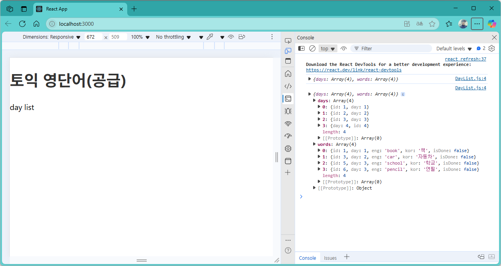

[](readme.md)

## S09. 더미 데이터 조회, map() 반복문	
> 개요

### 단어장 개발 
- [프로젝트 생성](#프로젝트-생성) : 새 프로젝트(word) 생성 후 기본 스타일(index.css) 적용 
- [속성값 전달2](#속성값-전달2) : 읽어온 속성값을 state로 관리
- [속성값 전달3](#속성값-전달3) : 읽어온 속성값을 state로 관리
- [속성값 전달4](#속성값-전달4) : 컴포넌트의 속성값 변경하기.

---

### 더미데이터 읽어오기

### 컴포넌트 DayList : db/data.json 으로부터 데이터 읽어오기
- component/DayList.js
```js
import dummy from "../db/data.json";

export default function DayList() {
    console.log(dummy);
    return <>day list </>
}
```

- component/Header.js
```js
import DayList from "./DayList";

export default function Header() {
  return (
    <div className="header">
      <h1>
        <a href="/">토익 영단어(공급)</a>
      </h1>
      <DayList />
    </div>
  );
}
```


- App.js : 첫화면에서 Header 태그 읽어온다 (Data는 Header의 DayList 태그에서 읽어옴옴)
```js
import Header from "./component/Header";

function App() {
  return (
    <div className="App">
      <Header/>
    </div>
  );
}

export default App;
```


- localhost:3000
> Console에서 읽어온온 데이터값 확인




---
[[TOP]](#s09-더미-데이터-조회-map-반복문)
<br/>

