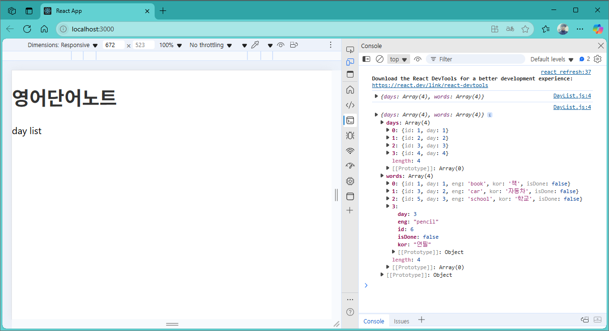

[](readme.md)

## S09. 데이터 조회, map() 반복문	
> 개요

### 단어장 개발 
- [프로젝트 생성](s09_create_project.md) : 새 프로젝트(word) 생성 후 기본 스타일(index.css) 적용 
- [데이터 조회1](#데이터-조회1) : 데이터파일(db/data.json) 읽어와서 console에서 확인
- [데이터 조회2](#데이터-조회2) : 데이터파일에서 Day별 단어리스트를 화면에 출력
---

### 데이터 조회1
> 컴포넌트 DayList : db/data.json 으로부터 데이터 읽어오기

- component/DayList.js

```js
import dbdata from "../db/data.json";

export default function DayList() {
    console.log(dbdata);
    return <>day list </>
}
```

- component/Header.js
```js
import DayList from "./DayList";

export default function Header() {
  return (
    <div className="App">
      <header className="App-header">
        <h1>
          <a href="/">영어단어노트</a>
        </h1>
      </header>
      <DayList />
    </div>
  );
}
```


- App.js : 첫화면에서 Header 태그 읽어온다 (Data는 Header의 DayList 태그에서 읽어옴옴)
```js
import Header from "./component/Header";

function App() {
  return (
    <div className="App">
      <Header /> 
    </div>
  );
} 

export default App;
```
<br/>

- localhost:3000
> Console에서 읽어온 데이터값 확인



---
[[TOP]](#s09-더미-데이터-조회-map-반복문)
<br/>

### 데이터 조회2
> 데이터파일에서 Day별 단어리스트를 화면에 출력

- App.js
```js
import Header from "./component/Header";
import DayList from "./component/DayList"; 
import Day from "./component/Day";

function App() {
  return (
    <div className="App">
      <Header /> 
      <DayList />
      <Day />
    </div>
  );
}

export default App;
```

- component/Header.js
```js
export default function Header() {
  return (
    <div className="App">
      <header className="App-header">
        <h1>
          <a href="/">영어단어노트</a>
        </h1>
        <div align="right">
          <button>단어 추가</button> &nbsp;
          <button>DAY 추가</button> &nbsp;
        </div>
      </header>
    </div>
  );
}
```

- component/DayList.js
```js
import dbdata from "../db/data.json";

export default function DayList() {
    console.log("DayList");
    console.log(dbdata);
    // console.log(dbdata.days);
    return (
      <ul className="list_day">
        { dbdata.days.map(day => (
          <li key={day.id}>
            <a href={`/day/${day.day}`}>
              Day {day.day}
            </a>
          </li>
        ))}
      </ul>
    );
}

```

- component/Day.js
```js
import dbdata from "../db/data.json";

export default function Day(props) {
    // dbdata.word 
    const day = 3; // 예시로 3일차 단어를 표시
    const wordList = dbdata.words.filter((word) => word.day === day);
    if (wordList.length === 0) {
      return <p>해당 날짜에 단어가 없습니다.</p>;
    }
    console.log("Day "+day);
    console.log(wordList);
    // 단어 목록을 테이블로 표시
    return (<>
      <table>
        <thead>
          <tr bgcolor="#E0E0E0" border="1">
            <td>day idx</td>
            <td>eng</td>
            <td>kor</td>
          </tr> 
        </thead>
        <tbody>
        {wordList.map((word) => (
          <tr key={word.id}>
            <td>D{word.day} - {word.id}</td>
            <td>{word.eng}</td>
            <td>{word.kor}</td>
          </tr>
        ))}
        </tbody>
      </table>
      </>
    );
}

```

- localhost:3000


---
[[TOP]](#s09-더미-데이터-조회-map-반복문)
<br/>

