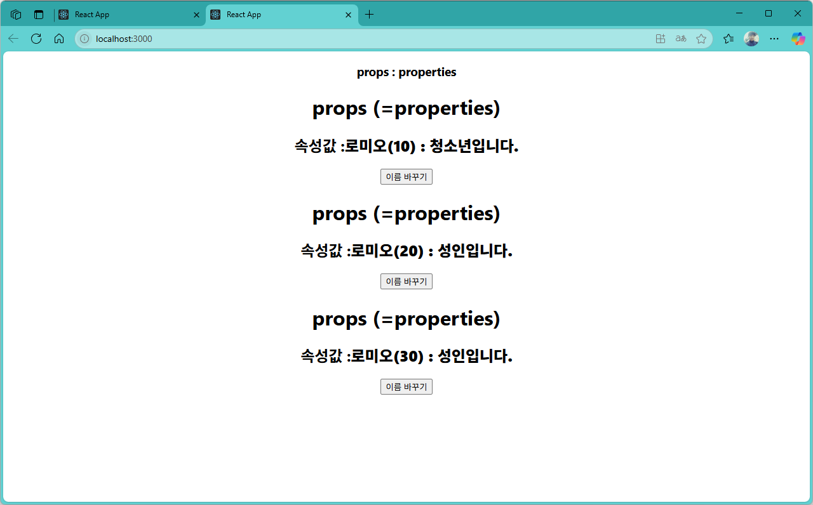

[](readme.md)

## S10. 라우터 구현 react-router-dom
> 개요

### 페이지내 이동
- [실습1](#실습1) : 실습코드1
- [실습2](#실습2) : 실습코드2

---

### react-router-dom 패키지 설치

```powershell
npm install react-router-dom
``` 
> 만약 패키지를 설치하다가 **취약점(vulnerabilities)** 이 발견되었다면, 아래와 같이 해결
> - `npm audit fix` : 자동으로 해결 가능한 취약점을 수정
> - `npm aucit ` : 상세 정보 확인 (수정되지 않은 취약점이 있는 경우)

```powershell
PS C:\GitHub\D2505_React\lect\react\word> npm install react-router-dom

added 4 packages, and audited 1346 packages in 3s

269 packages are looking for funding
  run `npm fund` for details

9 vulnerabilities (3 moderate, 6 high)

To address all issues (including breaking changes), run:
  npm audit fix --force

Run `npm audit` for details.
PS C:\GitHub\D2505_React\lect\react\word> npm audit fix --force
npm warn using --force Recommended protections disabled.
npm warn audit Updating react-scripts to 0.0.0, which is a SemVer major change.

removed 1302 packages, changed 1 package, and audited 44 packages in 5s

3 packages are looking for funding
  run `npm fund` for details

found 0 vulnerabilities
PS C:\GitHub\D2505_React\lect\react\word> npm audit
found 0 vulnerabilities
PS C:\GitHub\D2505_React\lect\react\word>

```


- App.js
```js

```

- localhost:3000



---
[[TOP]](#s99-문서포맷
<br/>

### 실습2
- 파일경로/파일명.js
```js

```

- localhost:3000


---
[[TOP]](#s99-문서포맷
<br/>

